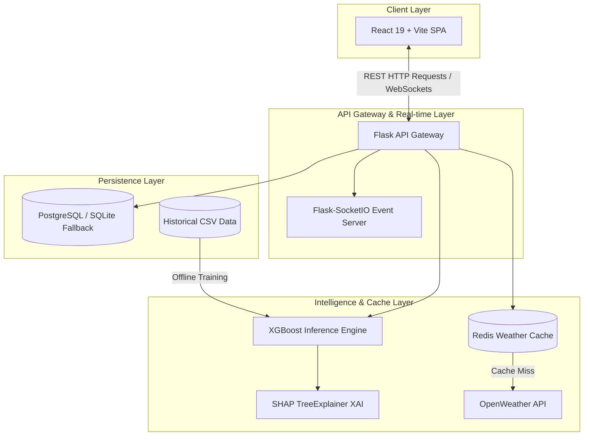

# ✈️ FlightDelay.OS: Enterprise Flight Prediction Infrastructure

FlightDelay.OS is a **production-grade, real-time machine learning platform** designed for aviation delay forecasting and MLOps analytics. The system features a modular backend, a reactive frontend dashboard, a stateful ML feature pipeline, caching strategies, and real-time model drift monitoring.

---

## 🏗️ System Architecture

The application is built using a **Service-Oriented Architecture** ensuring loose coupling, caching performance, and database portability.



---

## 🌟 Premium Engineering Features

- **🚀 Modular Flask Gateway**: Versioned REST endpoints (API v1) with strict **Pydantic v2 validation** of incoming IATA inputs and request structures.
- **⚛️ Modern React 19 SPA**: Built with **Vite** and **Tailwind CSS v4**. Utilizes Glassmorphic elements, dynamic **Recharts** timeline plots, and smooth Framer Motion micro-animations.
- **⚡ Real-time WebSockets**: Employs **Flask-SocketIO** and **Socket.io-client** to broadcast newly generated flight delay predictions to all active clients, instantly updating history lists and metrics.
- **🧠 SHAP Explainable AI (XAI)**: Calculates local feature contributions (Duration, Congestion, Weather, and Humidity) for every prediction on-the-fly using `shap.TreeExplainer`, visualising positive/negative delay factors in a sleek progress breakdown.
- **💾 Redis Cache**: Caches OpenWeather API responses for 15 minutes, avoiding endpoint rate-limit exhaustion and slashing response times from ~300ms to <10ms.
- **📊 Live Analytics**: A standalone **Dash Dashboard** running under Flask application context that polls the database every 5 seconds to merge training records with production predictions.
- **🔒 Secure Session Auth**: Cross-origin session-based authentication modals (Login/Registration) embedded directly inside the SPA with credentialed CORS.
- **📈 MLOps Model Drift Endpoint**: Running a **Kolmogorov-Smirnov statistical test** (`scipy.stats.ks_2samp`) comparing live predictions against training set distributions to flag data drift.
- **🔌 Automatic DB Fallback**: Tests connection to PostgreSQL on startup. If unavailable, falls back to local SQLite automatically, simplifying onboarding.

---

## 🛠️ Technology Stack

| Component | Technology / Library | Description |
| :--- | :--- | :--- |
| **Backend Framework** | Flask, Flask-CORS | API Gateway, blueprint-routing, CORS controls |
| **Real-time Server** | Flask-SocketIO | Event broadcasting |
| **Inference Engine** | XGBoost (v2.x) | Gradient boosted decision trees model |
| **Explainable AI** | SHAP | Local feature contributions calculations |
| **Database ORM** | Flask-SQLAlchemy, SQLite, PostgreSQL | Data layer persistence |
| **Caching Layer** | Redis | Weather API caching |
| **Validation Layer** | Pydantic v2 | JSON request type-safety |
| **Analytics Server** | Dash, Plotly, Dash-Bootstrap | Statistical charts & trends server |
| **Frontend Core** | React 19, Axios | Component rendering, credentialed HTTP calls |
| **Visual Charts** | Recharts | Live frontend area charts |
| **Build Tools** | Vite | Quick hot-reload bundler |
| **Styles** | Tailwind CSS v4, Framer Motion | Styles, glassmorphism, animations |

---

## 📁 Project Directory Layout

```text
Flight-Delay-Prediction/
├── backend/
│   ├── app/
│   │   ├── core/           # Pydantic settings and env configurations
│   │   ├── models/         # SQLAlchemy Schemas (User, Prediction)
│   │   ├── services/       # XGBoost inference and Redis weather services
│   │   └── api/            # API blueprints (Auth, Predict, Stats, Drift)
│   ├── Dockerfile          # Backend Docker builder
│   ├── requirements.txt    # Python requirements
│   ├── run.py              # Backend entrypoint (Port 5000)
│   ├── seed.py             # Database seed script
│   └── analytics.py        # Dash analytics dashboard (Port 8050)
├── frontend/
│   ├── src/
│   │   ├── components/     # Navbar, Form, Autocomplete list, HistoryList
│   │   ├── App.jsx         # Dashboard hub (WebSockets, modals, Recharts)
│   │   └── index.css       # Tailwind CSS v4 imports & glassmorphic system
│   ├── index.html          # HTML Entrypoint
│   └── Dockerfile          # Nginx production frontend server
├── ml/
│   ├── models/             # XGBoost model artifacts and saved pipeline medians
│   └── pipeline/           # Preprocessing (imputation) and training scripts
├── data/
│   └── flight_data.csv     # Historical training dataset
├── scripts/
│   └── generate_data.py    # Synthetic training data generator
└── docker-compose.yml      # Multi-container local orchestration
```

---

## 🚦 Installation & Setup

### Prerequisites
- Python 3.11+
- Node.js 20+
- (Optional) Docker & Docker Compose

### 1️⃣ Local Setup

#### A. Set up Virtual Environment & Python dependencies
```bash
python -m venv venv
# On Windows
.\venv\Scripts\activate
# On macOS/Linux
source venv/bin/activate

pip install -r requirements.txt
```

#### B. Setup Frontend Node modules
```bash
cd frontend
npm install
cd ..
```

#### C. Seed Database & Start Services
Initialize the local SQLite database and populate dummy metrics:
```bash
python backend/seed.py
```

Launch the stack using multiple terminal windows:
```bash
# 1. API Server (Port 5000)
python backend/run.py

# 2. Analytics Dashboard (Port 8050)
python backend/analytics.py

# 3. Web Client (Port 5173)
cd frontend
npm run dev
```

---

### 2️⃣ Docker Compose Deployment

To build and launch the backend (Flask), frontend (Nginx), analytics dashboard (Dash), database (PostgreSQL), and cache (Redis) as a single multi-container application:
```bash
docker-compose up --build
```
Once initialized, the services are mapped as follows:
- **Web Client (React)**: `http://localhost:3000`
- **Backend API**: `http://localhost:5000`
- **Dash Analytics**: `http://localhost:8050`
- **Redis Cache**: `localhost:6379`
- **PostgreSQL**: `localhost:5432`

---

## 🔒 Configuration Variables (`.env`)

Create a `.env` file in the root directory to customize the environment variables:
```ini
# OpenWeather API Configuration
WEATHER_API_KEY=your_openweathermap_api_key_here

# Database Configuration (Defaults to 'db' for Docker, falls back to SQLite locally)
POSTGRES_SERVER=db
POSTGRES_USER=postgres
POSTGRES_PASSWORD=Ganesh@123
POSTGRES_DB=flight_delay_db

# Security Settings
SECRET_KEY=SUPER-SECRET-REPLACE-IN-PROD-473-449

# Redis Server Configuration
REDIS_HOST=redis
REDIS_PORT=6379
```

---

## 🔬 MLOps: Metrics & Explanations

### 1. Kolmogorov-Smirnov (KS) Drift Monitoring
To check if inputs have drifted from the historical baseline:
```bash
GET http://localhost:5000/api/v1/predict/drift
```
This performs a two-sample KS test comparing the delay values of the last 100 predictions against the training CSV delays. If $p < 0.05$, we reject the null hypothesis, suggesting that data drift has occurred and the model requires retraining.

### 2. SHAP Explanation Pipeline
To solve the issue of black-box ML predictions, we calculate local explanations:
$$\phi_0 + \sum_{i=1}^{M} \phi_i = f(x)$$
Where $\phi_0$ is the base value of predictions, and $\phi_i$ represents the minutes added or subtracted by feature $i$ (e.g. Congestion, Duration, Weather, Humidity). This outputs the contribution metrics displayed in the user results dialog.

---

## 🛤️ Roadmap

- [x] **Real-time WebSockets**: Interactive Socket.io updates for historical activity logs.
- [x] **Stateful Pipeline Imputation**: Fixed ML single-row imputation bug using saved training medians.
- [x] **Redis API Caching**: Integrated weather response caching to accelerate API execution.
- [ ] **Kubernetes Deployment**: Migrating Docker Compose manifests into K8s charts for auto-scaling.
- [ ] **Prometheus/Grafana Metrics**: Hooking up Prometheus scrapers to alert SREs when drift occurs.
