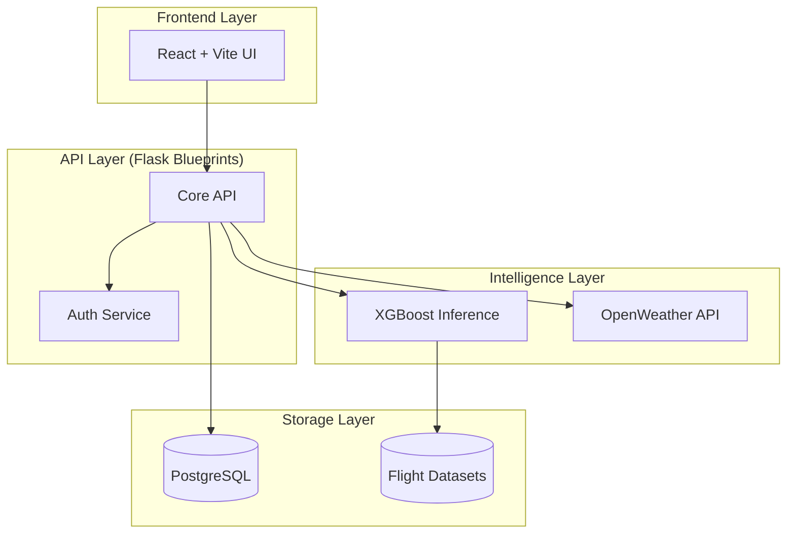

# ✈️ FlightDelay.OS: Enterprise Flight Prediction Infrastructure

FlightDelay.OS is a **production-grade machine learning platform** designed for aviation delay forecasting. This project has been refactored from a monolithic prototype into a modular, scalable, and observable ecosystem suitable for enterprise-level deployment.

---

## 🏗️ System Architecture

The application is built using a **Modular Service-Oriented Architecture** to ensure high availability and maintainability.



---

## 🌟 Premium Engineering Features

- **🚀 Modular Backend**: Versioned API endpoints using Flask Blueprints, a dedicated Service Layer, and Pydantic validation.
- **⚛️ Modern Frontend**: Built with **React 19, Vite, and Tailwind CSS v4**. Features high-end Glassmorphism, dynamic Recharts visuals, and Framer Motion animations.
- **🧠 ML Reproducibility & XAI**: Unified Feature Engineering pipeline (with saved state medians) and real-time **SHAP Explainable AI** contribution metrics.
- **⚡ Real-time Updates**: Instant client updates using **WebSockets (Flask-SocketIO & Socket.io-client)**.
- **💾 Redis Weather Caching**: Accelerated predictions using **Redis caching** to save OpenWeather API requests for 15 minutes.
- **🔒 Secure Authentication**: Integrated session-based cookie authentication modals directly in the React frontend.
- **📊 Advanced Analytics**: Standalone Dash analytics service reading directly from the database with a 5s auto-refresh interval.
- **🐳 DevOps Ready**: Full **Docker & Docker Compose** support for one-command deployment, plus an automatic SQLite fallback for hassle-free local development.

---

## 🚦 Getting Started

### 1️⃣ Clone and Prepare
```bash
python -m venv venv
source venv/bin/activate  # or .\venv\Scripts\activate
pip install -r requirements.txt
```

### 2️⃣ Initialize Infrastructure
Configure your `.env` with your PostgreSQL, Redis, and OpenWeather API keys, then seed the system:
```bash
# Seeding triggers DB creation and populates initial admin/prediction profiles
python backend/seed.py
```
*(If PostgreSQL or Redis is not running locally, the application will automatically fall back to SQLite and run without cache).*

### 3️⃣ Launch the Ecosystem
You can run the components individually or via Docker:

*   **API Server**: `python backend/run.py` (Port 5000)
*   **Analytics**: `python backend/analytics.py` (Port 8050)
*   **Web Client**: `cd frontend && npm run dev` (Port 5173)

**Docker Deployment:**
```bash
docker-compose up --build
```

---

## 🔧 Project Organization

- `backend/`: Core logic, API v1, and Analytics service.
- `frontend/`: Modern React SPA (Single Page Application).
- `ml/`: Reproducible training pipelines and model artifacts.
- `scripts/`: Data generation and seeding utilities.

---

## 💎 Resume Worthy Tech
**SDE / ML / Full-Stack Proficiency:**
*   **UX**: Glassmorphism, Responsive Dark Mode, WebSockets Live Feed, Recharts Analytics.
*   **Intelligence**: XGBoost, stateful Feature Engineering, SHAP TreeExplainer.
*   **Infrastructure**: Redis Caching, SQLite/Postgres Dynamic Fallback.

---

## 🛠️ Detailed System Design Decisions

- **Why Flask + Blueprints?**: While FastAPI is modern, Flask with Blueprints is the industry standard for stable, large-scale enterprise Python applications, providing better compatibility with legacy enterprise extensions like Flask-Admin.
- **Why React + Vite?**: Vite offers near-instant hot module replacement (HMR), significantly improving developer experience over traditional Webpack-based CRA.
- **Why XAI (SHAP)?**: Most ML models are "black boxes." By integrating SHAP, we provide **transparency**, allowing users to see exactly which factors (e.g., high congestion + rain) are driving the delay prediction.

---

## 🛤️ Future Roadmap

- [ ] **Kubernetes Orchestration**: Migrating from Docker Compose to K8s for auto-scaling.
- [x] **Real-time WebSockets**: Replacing polling with Socket.io for instantaneous dashboard updates.
- [ ] **Model Drift Monitoring**: Implementing Prometheus alerts when model accuracy drops below a threshold.

---
🚀 *Engineered for performance. Built for the future of aviation analytics.*
