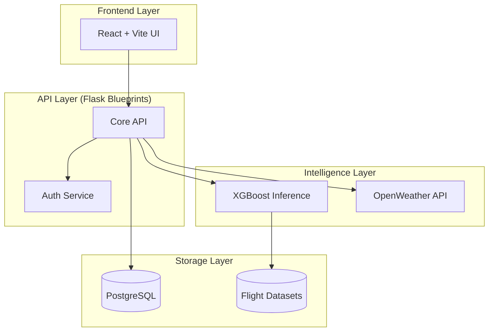

# ✈️ FlightDelay.OS: Enterprise Flight Prediction Infrastructure

FlightDelay.OS is a **production-grade machine learning platform** designed for aviation delay forecasting. This project has been refactored from a monolithic prototype into a modular, scalable, and observable ecosystem suitable for enterprise-level deployment.

---

## 🏗️ System Architecture

The application is built using a **Modular Service-Oriented Architecture** to ensure high availability and maintainability.



---

## 🌟 Premium Engineering Features

- **🚀 Modular Backend**: Versioned API endpoints using Flask Blueprints and a dedicated Service Layer.
- **⚛️ Modern Frontend**: Built with **React 18, Vite, and Tailwind CSS**. Features high-end Glassmorphism and Framer Motion animations.
- **🧠 ML Reproducibility**: Unified Feature Engineering layer and versioned model registry.
- **🔒 Security Hardened**: Centralized config with **Pydantic Settings**, URL-encoded credentials, and JWT-ready JSON auth.
- **📊 Advanced Analytics**: Standalone Dash analytics service with statistical trendlines and performance metrics.
- **🐳 DevOps Ready**: Full **Docker & Docker Compose** support for one-command deployment.

---

## 🚦 Getting Started

### 1️⃣ Clone and Prepare
```bash
python -m venv venv
source venv/bin/activate  # or .\venv\Scripts\activate
pip install -r requirements.txt
```

### 2️⃣ Initialize Infrastructure
Configure your `.env` or `config.py` with your PostgreSQL and OpenWeather API keys, then seed the system:
```bash
cd backend
python seed.py
```

### 3️⃣ Launch the Ecosystem
You can run the components individually or via Docker:

*   **API Server**: `python backend/run.py` (Port 5000)
*   **Analytics**: `python backend/analytics.py` (Port 8050)
*   **Web Client**: `cd frontend && npm run dev` (Port 5173)

**Docker Deployment:**
```bash
docker-compose up --build
```

---

## 🔧 Project Organization

- `backend/`: Core logic, API v1, and Analytics service.
- `frontend/`: Modern React SPA (Single Page Application).
- `ml/`: Reproducible training pipelines and model artifacts.
- `scripts/`: Data generation and seeding utilities.
- `docker/`: Production deployment configurations.

---

## 💎 Resume Worthy Tech
**SDE / ML / Full-Stack Proficiency:**
*   **Patterns**: Service Layer, Repository Pattern, App Factory.
*   **MLOps**: Feature Store logic, Model Metrics Tracking.
*   **UX**: Glassmorphism, Responsive Dark Mode, Async Feedback Loops.

---
🚀 *Engineered for performance. Built for the future of aviation analytics.*
